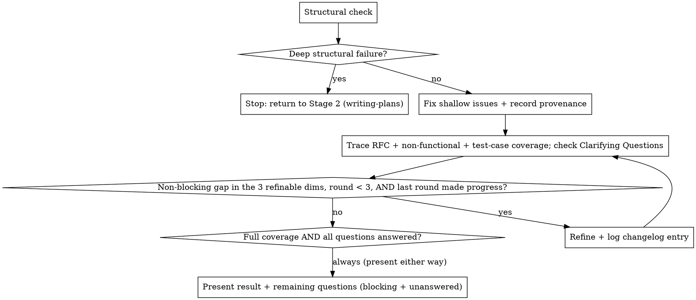

# Plan Coverage Check

## Overview

Verify that a PLAN.md implements every element of its source RFC, is safe for the kind of service it targets, is fully test-case-specified, and carries no unanswered question it could resolve itself, then refine it until it either fully covers all dimensions or is blocked only by decisions the user must make.

Core principle: **every RFC element traces to a named plan task, every applicable non-functional concern is addressed or deliberately excluded, every task's test cases are concrete enough to write as failing tests, and every Clarifying Question has an answer — or each is an explicit, classified gap.**

## When to Use

- A PLAN.md exists and must be checked against its RFC before handoff to implementation.
- Someone asks "does this plan cover everything" or "where are the gaps".
- After drafting or cleaning a plan, as the closing verification step.

Not for: writing the plan itself (use `writing-plans`); checking an RFC against a PRD with no plan yet (use an RFC-coverage skill).

## Method

0. **Structural check first — cheap, before anything else.** Before tracing a single requirement, verify the plan document is well-formed: every task has all required fields (Implements/Depends on/Where/Current state/Change/Removes/Verify), task IDs are unique, every "Depends on" reference resolves to a task ID that actually exists in this plan (or, in multi-repo mode, in the master or the relevant child, or, in a split plan, in an earlier slice named in this slice's Context), the dependency graph has no cycles, and the required top-level sections (Context, Decisions, Execution Plan, Task Sequence, Testing & Validation, Risks, Clarifying Questions) are present — and that Risks and Clarifying Questions are genuinely distinct, not one section doing both jobs. Also check output hygiene: every JSON/JSONC fenced block parses, every `mermaid` block uses syntax that actually renders, and no fenced block or task description carries what looks like a real credential, API key, or connection string (if one slipped in from an explored config file, replace it with a placeholder and point the task at where the real value should come from instead). This check is deterministic; it doesn't need judgment calls, so do it before the more expensive step below.

   **Two different kinds of structural failure need two different responses.** A *shallow* failure — a missing field, an unrenderable mermaid block, a stray credential — is mechanical to fix: fix it in place (add the field, correct the syntax, redact the value) and continue to step 0.5. A *deep* failure means the plan's foundational shape is wrong, not just incomplete — a cyclic dependency graph (a real ordering contradiction, not a typo in an ID), or a task list that doesn't actually decompose the RFC's elements at all. A deep failure is **not something this skill refines its own way out of**: stop here, do not proceed to step 0.5 or the trace, and report that the plan needs to be re-drafted by `writing-plans` rather than patched — this is the one case where the right move is back to Stage 2, not another Stage 4 round.
0.5. **Record provenance.** If the plan's Context section doesn't yet record the repo commit SHA(s) it was grounded against (per service, in multi-repo mode), capture them now — a plan is only auditable against the exact code it cites if that code's state is pinned, not implied.
1. **Load RFC elements.** Enumerate every named element from the RFC — endpoints, fields, flows, config knobs, data-model changes, key decisions, rollout steps — grouped by the RFC's own sections. If the RFC carries its own Requirements Coverage matrix (traced back to a PRD), inherit that grouping so a reader can follow PRD → RFC → plan in one line of sight.
2. **Trace each element** to the plan task that implements it — a specific task ID. If none, mark it a gap.
3. **Write the coverage section** into the plan: an RFC Coverage matrix, grouped to mirror the RFC, each row pointing to the satisfying task(s) or the gap.
4. **Classify** each element and each open question:

   | Element | Meaning |
   |---|---|
   | Covered | Traces to a concrete task ID. |
   | Covered-pending-decision | A task exists but depends on an unresolved open question in the plan or RFC. |
   | Missing | No task; the plan must change. |
   | ⚪ Out of scope | The RFC element belongs to a phase or service explicitly excluded by this plan's stated Scope. Carried into the matrix with its reason; not counted as a gap. |

   An open question is **blocking** when answering it would change which files a task touches or the task's dependency order; **non-blocking** when it's a detail the plan can resolve from repository knowledge.
5. **Check non-functional coverage.** RFC-element traceability alone doesn't catch a plan that implements every endpoint but forgets the worker's dedup logic or the API's retry behavior — a gap analysis run only against the RFC's stated elements would show full coverage while the plan is still unsafe to ship. For each classified service in the plan (see `writing-plans`' service-playbooks.md), check its applicable non-functional concerns against the tasks: does a task address it, is it deliberately out of scope with a stated reason, or is it silently missing? Write this as a second matrix (or a second column set) alongside the RFC Coverage matrix, using the same three-way classification: **Covered** (a task addresses it), **Deliberately excluded** (stated reason — e.g. "no retries needed, this call has no side effects"), or **Missing** (applies, no task, no stated reason). Missing rows here are gaps exactly like a missing RFC element.
5.5. **Check test-case coverage.** For every task in the plan (except a pure config/doc/no-op task), verify its Test Cases table has at least one case in each required category: happy, edge, error, plus whatever the task's service playbook requires beyond that (e.g. an idempotency case for a task marked non-functional on an api-service, a dedup case on a worker, an offline/error-state case on a frontend/mobile task — see each type's "Required test-case categories" in `service-playbooks.md`). Classify per task: **Covered** (all required categories present with concrete Given/When/Then, not placeholders), **Partial** (some categories present, at least one required category missing), or **Missing** (no Test Cases table at all). Partial and Missing are gaps, refined the same way as the other two dimensions — add the missing case(s), don't just note that they're missing.
5.7. **Check the Clarifying Questions section.** This dimension works differently from the other three: it is never auto-refined, because by definition every item in it is something `writing-plans` could not resolve from the RFC, PRD, settled decisions, or repo evidence — if it could have been resolved that way, it would already be a grounded fact in the plan, not a question. So: verify every item is phrased as a direct, answerable question (not a restated ambiguity) and is genuinely plan-scoped, not an RFC-level question that leaked in (see `writing-plans`' No-Assumptions Rule — if answering it would change a contract or flow, that's a gap in the RFC to raise instead, not a plan question). Any unanswered item here is **always blocking** — it stops the plan from being considered complete regardless of round count, and is presented to the human alongside any other blocking gaps.
6. **Refine and re-check.** For non-blocking gaps — RFC-element, non-functional, or test-case — add or adjust tasks (or their Test Cases tables) to close them, grounded in the codebase where a fact is needed, then re-run the trace. A missing test-case category is nearly always non-blocking (no product decision required to write the case), so refine it directly rather than surfacing it. Clarifying Questions are never touched by this refinement step — they wait for the human's answer, then get folded into the plan as grounded facts (with the answer as their citable source) on the next pass. After each round, append a one-line changelog entry (round number, which gap it closed, what evidence closed it) so the refinement history is visible inside the document itself. Repeat, capped at **3 refinement rounds** — but stop sooner, immediately, if a round closes zero gaps across the three refinable dimensions: a round that makes no progress will not make progress by repeating with the same information, so treat "no change this round" as its own stop signal rather than waiting for the cap.
7. **Stop** when any of the following is true, whichever comes first: every RFC element, non-functional concern, and task's test-case coverage is Covered or Deliberately-excluded **and** every Clarifying Question is answered; the only remaining gaps are Covered-pending-decision / Missing on **blocking** questions, or unanswered Clarifying Questions; the last round made zero progress; or the 3-round cap is reached. Present the coverage result and the remaining questions (blocking, unanswered, zero-progress, or cap-triggered) as a single decision list — don't present Clarifying Questions and blocking RFC gaps as two separate lists; the human needs one list to answer.

## Refinement Loop

## Multi-Repo Mode

When the plan set is a master plus child plans (the pipeline's multi-repo mode), the coverage matrix lives in the **master plan** and gains a Service column: each row traces **RFC element → service → task ID in that service's child plan**, or → a shared-contract task in the master.

**Multi-owner rule.** An RFC element the writing-plans stage split across services (per its Attribution step) is **Covered only when every owning service's child plan contains its task**. An element is only as covered as its weakest service; if one owner's task exists and another's doesn't, the element is **Missing**, not Covered. A single-owner element is Covered as soon as its one owner has the task. A multi-owner element is Covered-pending-decision when at least one owner's task is pending and none is Missing.

**Out-of-scope rows persist.** ⚪ rows carried from the RFC (or from the plan's stated Scope exclusions) stay in the matrix with their reason.

**Non-functional coverage stays per-service.** Each service's non-functional matrix (step 5) is checked against that service's own classified playbook only — a worker's dedup/DLQ concerns are never checked against an API service's checklist or vice versa, even within the same master plan.

**Test-case coverage stays per-task, checked in every child plan independently.** There's no cross-service rollup here — each task's Test Cases table is judged against its own service's required categories (step 5.5), whether that task lives in the master or a child plan.

**Targeted refinement.** When closing a non-blocking gap, dispatch the exploration agent into the **specific service repo** the gap belongs to, not a sweep across all repos. Add the task to the relevant document — a shared-contract task in the master, a service task in that service's child plan — then re-trace, and update that service's dependency sequence if needed.

## Split-Plan Mode

When `writing-plans` split a large single-repo (or single-service) plan into numbered slices (see its "Splitting Large Plans"), coverage is checked **across the full set of slices as one unit**, not per file. Load RFC elements once; trace each to a task ID regardless of which slice file holds it; the RFC Coverage matrix, non-functional matrix, and Clarifying Questions are each one logical set spanning all slices (living in the Plan Index slice, or in a standalone index file if one exists). A task's dependency on an earlier slice (stated in that slice's Context) is checked the same way an in-file "Depends on" is — the referenced task must exist in the named slice.

Structural and provenance checks (step 0, 0.5) run per slice file (each is still its own well-formed document), but the coverage trace (steps 1–5.7) treats the slice set as the plan.

## Common Mistakes

- **Vague trace targets.** "Handled somewhere in the tasks" is not a trace. Point to a task ID.
- **Auto-refining a blocking gap.** If closing a gap needs a product/architecture decision, do not invent one — surface it.
- **Looping forever.** Cap refinement at 3 rounds; stop and present when only blocking questions or the cap remain.
- **Waiting for the cap when a round made no progress.** A round that closes zero gaps is its own stop signal — don't burn the remaining rounds re-running the same trace against the same information.
- **Skipping the structural check.** Don't spend a refinement round on a plan whose tasks are missing required fields or whose dependency graph has a cycle — catch that first, cheaply, before the judgment-heavy trace.
- **Trying to refine a deep structural failure instead of stopping.** A cyclic dependency graph reflecting a real contradiction, or a task list that doesn't decompose the RFC at all, is a Stage 2 problem — stop and send it back to `writing-plans` rather than spending refinement rounds patching a plan whose foundational shape is wrong.
- **Leaving a real credential or connection string in the plan** because it was copied from an explored config file — redact it and point at where the value should come from instead.
- **Skipping the changelog.** Without a one-line entry per refinement round, a reader of the final plan can't tell what was auto-refined versus original — record it as you go, not retroactively.
- **Only checking RFC-element coverage.** A plan can trace every RFC element to a task and still be unsafe — a worker with no dedup logic, an API with no retry/idempotency story. Run the non-functional check every round, not just once at the end.
- **Accepting a placeholder test case as Covered.** A Test Cases row with `...` or "TBD" in the Given/When/Then columns is Missing, not Covered — the whole point of this dimension is concrete, fillable-in cases.
- **Treating a missing test-case category as blocking.** It almost never is — writing the case doesn't need a product decision, so refine it directly instead of surfacing it as a gap needing human input.
- **Trying to auto-refine a Clarifying Question.** These exist precisely because `writing-plans` couldn't resolve them from any available source — refining one yourself just replaces a visible unknown with an invisible assumption. Present it, don't answer it.
- **Letting an RFC-level question hide in Clarifying Questions.** If an item there would actually change a contract or flow, it's a gap in the RFC — say so, don't let the plan quietly hold a question that isn't its job to hold.
- **Checking coverage per-slice instead of across the whole split-plan set.** A requirement covered in slice 2 still needs to show up as Covered when checking slice 1's view of the matrix — see Split-Plan Mode.
- **Dropping elements.** The matrix must list every RFC element, including out-of-scope ones (marked with a reason). In multi-repo mode the matrix has one row per (element, owning service); a multi-owner element appears once per owner and all its rows must be Covered for it to count as covered.
- **Editing the RFC to fit the plan.** Refine the plan, not the RFC — if the RFC itself is wrong, that's a decision to surface, not silently work around.
- **Forgetting to update the dependency sequence** after adding a task during refinement — an added task needs its place in the Task Sequence diagram too, not just a row in the matrix.
